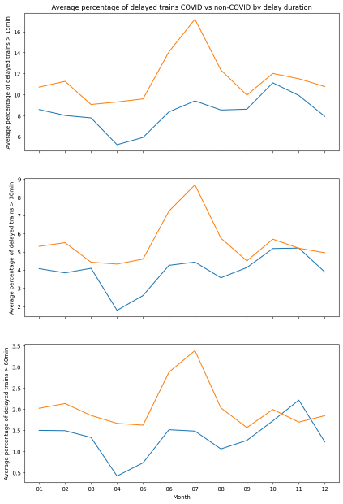

# French Railways in Pandemic and Non-pandemic Times: An Analysis (Launch Challenge Hosted by Forge FA23)
This repo consists of files submitted to the Launch Challenge hosted by Forge Fall 2023. The data analyzed and visualized records the overall operations of SNCF trains of France from January 2018 to 
June 2023, with data including average travel time, number of scheduled trains, number of delayed trains (with respect to different degree of delayed time), average time of delay, percentages of delay due to various reasons, etc. Each row of data contains the monthly averaged information of one direction of a route.

## Introduction of Dataset
- Source: Société Nationale des Chemins de Fer Français
                  (SNCF, French National Railways)
- Link: http://bit.ly/regularite-mensuelle-tgv-par-liaisons
- Size: 8,154 rows by 26 columns
- Description: The dataset records the overall operations of SNCF trains from January 2018 to June 2023, with data including average travel time, number of scheduled trains, number of delayed trains (with respect to different degree of delayed time), average time of delay, percentages of delay due to different reasons, etc. Each row of data contains the monthly averaged information of one direction of a route.

## Why this Dataset? What about it?

- WHY: Previous experience of taking trains in Europe
  - Highly unstable departure and arrival status: constant delay and cancellation
  - Various reasons for delay: strike, railroad infrastructure, passenger
- WHAT: Relationships between different features of data about trains
  - Between time periods in a year and performance of train operation
  - Between length or number of trains of a route and performance of operation for the route
  - Specific to this dataset: 
    - Performance in pandemic times and non-pandemic times
    - Performance during lockdown and non-lockdown times within pandemic

## Questions to be asked

- How does the number of scheduled trains/percentage of delay fluctuate through time?
- Does train punctuality vary significantly by season or month?
- Does train punctuality differ with lockdown or without during pandemic?
- The relationship between number of scheduled trains and percentage of delayed trains
- The relationship between travel time and percentage of delayed trains
- The relationship between travel time and average delay of all trains on arrival/at departure
- Does a specific cause of delay happen more likely in certain months?
- The correlations among different delay causes

## Data Preprocessing

- Column names translated into English through DeepL
- Three columns of natural language comments describing the delay dropped
  - High percentage of missing values
  - Lengthy description in French might lost the original meaning even if translated into English
- New columns created: Percentage of trains delayed
  - By (Number of trains delayed/Number of scheduled trains*100)
  - In terms of different categories: at departure, on arrival, > 15min, > 30min, > 60min
- Aggregated dataset created
  - 8,154 monthly entries condensed into 65 direction-free routes
  - The aggregated data of each route is the original data averaged across both directions and different months

## Data Visualizations

- Seaborn package of Python
- Time-related charts: lineplot()
  - Topic: Percentage of delay trains (15min+, 30min+ and 60min+), pandemic vs. non-pandemic
  - Original approach: draw all six trends in one graph
  - Result: overlapping lines; hard to see the comparison between pandemic and non-pandemic
  - Corrected approach: Three-subplot plot to give pairwise comparison 
- Relationship between data columns: regplot()
  - Topic: Percentage of train delay at departure ~ Number of scheduled trains
  - Original approach: draw all 8,154 data points on the scatter plot
  - Result: crammed up dots that take up entire space; hard to see a pattern
  - Corrected approach: use the aggregated dataset and put 65 dots on the scatter plot to see a clear pattern

## French Strikes & Lockdowns

- Could affect train operation drastically
- 2018 April-June French train strike
- 2019–2020 French pension reform strike
  - Spanned from December 2019 to February 2020
- COVID-19 pandemic in France
  - Overall duration: January 2020 to February 2022
  - First lockdown: March 2020 to June 2020
  - Second lockdown: October 2020 to December 2020
  - Third lockdown: February 2021 to June 2021

## Findings
### Drastic Drops throughout the years

- 2019-2020 strike and the first two lockdowns are accounted for
- The third lockdown (2021/2 – 2021/6) saw rise in number instead
- By intuition, fewer railway workers means fewer trains during strikes, while lockdowns mean fewer travelers, the supply of train rides decreases accordingly
- Relatively stable (domestic ~300 per month, international ~125 per month) excluding the three big fluctuations
- Not stable throughout the years, might have more reasons

|  |
|:--:| 
| Figure 1 |

### Delay at departure fluctuate greatly

- 2019-2020 strike and the second lockdown coincide with the spike of trend, namely over 50% of the train delayed at departure
- An overall growth starting from 2021 to 2023
- Overall fluctuate within a smaller range and more on seasonal swing

|  |
|:--:| 
| Figure 2 |

### Delay on arrival lower during pandemic

- The pandemic times (2020/1-2022/2) sees lower percentage of delayed on arrival on average
- Bigger spikes (over 25% of trains delayed on arrival) coincide with the 2018 train strike and the start of the post-pandemic period (after February 2022)

|  |
|:--:| 
| Figure 3 |

### June sees the most delay, April the least

- Using .groupby() on the Month column, the mean percentage of delayed train across routes and different years on each month is acquired
- The percentage of trains delayed at departure leads that of trains delayed on arrival by at least 10 percent, at most nearly 30 percent
- Almost 45% of departing trains in June would be delayed (highest in chart), while around 10% of arriving train in April would be delayed (lowest in chart)
- The trends of departure and arrival delays resemble each other

|  |
|:--:| 
| Figure 4 |

### Departure and arrival different in COVID

- Using .loc() on the DateTime column, an isPandemic column is created to label each row into pandemic and non-pandemic times
- Percentage of delayed trains at departure during COVID fluctuates more than that during non-COVID
- Percentage of delayed trains on arrival during COVID is always lower than that during non-COVID
- Delay is worse during COVID times for departure, better on arrival

|  |
|:--:| 
| Figure 5 |
| Blue: Prct delayed at departure (pandemic) |
| Orange: Prct delayed on arrival (pandemic) |
| Green: Prct delayed at departure (normal) |
| Purple: Prct delayed on arrival (normal) |

### Better performance during COVID

Orange is non-pandemic times, blue is pandemic times
The peak for non-pandemic times occurs during July, while the peak for pandemic times occurs during November
There are almost always fewer trains delayed for 15, 30, 60 mins, or more during COVID than non-COVID

|  |
|:--:| 
| Figure 6 |

### Lockdown means more punctual trains

- Using .loc() on the DateTime column of the sub-dataset with only data during pandemic, an isLockdown column is created mark rows that are in the three lockdowns aforementioned
- All five barplots show a lower average percentage of delayed trains during lockdown than non-lockdown times in the pandemic
- During COVID times, trains during lockdown perform better in all measurement than non-lockdown

|  |
|:--:| 
| Figure 7 |

### Number of trains Does not affect delay at departure/on arrival

- Using the average data on 65 distinct routes, scatter plots and regression lines are drawn for mean number of scheduled trains being the predictor variable and mean percentage of delayed trains as a dependent variable
- Both charts have a flat regression line, hinted By ANOVA test, the p-value is 0.103 for the regression result for the percentage of delayed trains at departure and 0.331 for on arrival. For a threshold of p-value = 0.05, we cannot reject the null hypothesis that the number of scheduled trains has nothing to do with either of them

|  |
|:--:| 
| Figure 8 |

### Average travel time does not affect delay at departure/on arrival

- Using the average data on 65 distinct routes, scatter plots and regression lines are drawn for average travel time for each route being the predictor variable and mean percentage of delayed trains as dependent variable
- Both charts have a flat regression line, hinted By ANOVA test, the p-value is 0.260 for the regression result for percentage of delayed trains at departure and 0.186 for on arrival. For a threshold of p-value = 0.05, we cannot reject the null hypothesis that average travel time has nothing to do with either of them

|  |
|:--:| 
| Figure 9 |

### Delay on arrival is highly related to average travel time

- Setting average travel time as predictor and mean delay at departure/on arrival as dependent variable, regression line is almost horizontal for the departure case, while having a positive slope in the arrival case.
- By running ANOVA test, the p-value is 9.76*10-11 for the regression result the arrival case. It shows statistical significance and tells us the longer a train trip is, the longer it might be delayed when arriving. On the other hand, the p-value is 0.996 for the departure case. That means it’s almost certainly that the distribution is random (by a probability of 99.6%)! Travel time has nothing to do with delay duration at departure

|  |
|:--:| 
| Figure 10 |

## Delay Causes Definitions

- External causes: weather, obstacles, suspicious packages, malevolence, social movements
- Railway infrastructure: maintenance, works
- Traffic management: rail line traffic, network interaction
- Rolling stock: all the powered and non-powered carts on the railway
- Station management and reuse of equipment
- Passenger consideration: crowds, connections

## Delay cause Does not seem to correlate

- Correlation value among different delay causes are almost all negative
- The slightly more correlated pairs are external causes to traffic management and external causes to rolling stock (valued around -0.25)
- Minimal correlations among different delay causes

|  |
|:--:| 
| Figure 11 |

## Findings Summary

- The strikes and pandemic decreases the number of trains, but not necessarily punctuality
- One in 2 trains will be delayed at departure in June, while only 1 in 10 on arrival in April
- Departure punctuality dwindles in pandemic, while arrival punctuality improves
- Smaller percentage of trains is delayed for a certain duration in pandemic
- Train operation in lockdown is more punctual than non-lockdown period during pandemic
- No relationship between number of scheduled trains and percentage of delayed trains
- No relationship between travel time and percentage of delayed trains
- Positive relationship exists between travel time and average delay of trains on arrival
- Changes to natural elements and traveler volumes affect the main cause of delay
- Little to none correlations among different causes of delay

## If there is more time…

- Deeper analysis in different causes of delay
  - What causes of delay affect trains the most in terms of delay duration? (causes vs. delayed trains > mins)
  - What cause of delay have the highest percentage in pandemic?
- Route specific analysis
  - Which routes are affected the most by the external causes of delay? Could it be due to being in regions prone to harsh weather or frequent strikes?
- Prediction of percentage of delayed trains given a specific month, number of scheduled, travel time, and proportions of different causes of delay
  - Via scikit-learn, Using supervised learning with percentage of delayed trains as labels to train and predict

## License
This project is licensed under the MIT License.

## Contact
For any questions or issues, please contact Je-Ching (Michael) Liao at jechingliao@gmail.com / michaeljcliao@gmail.com .
